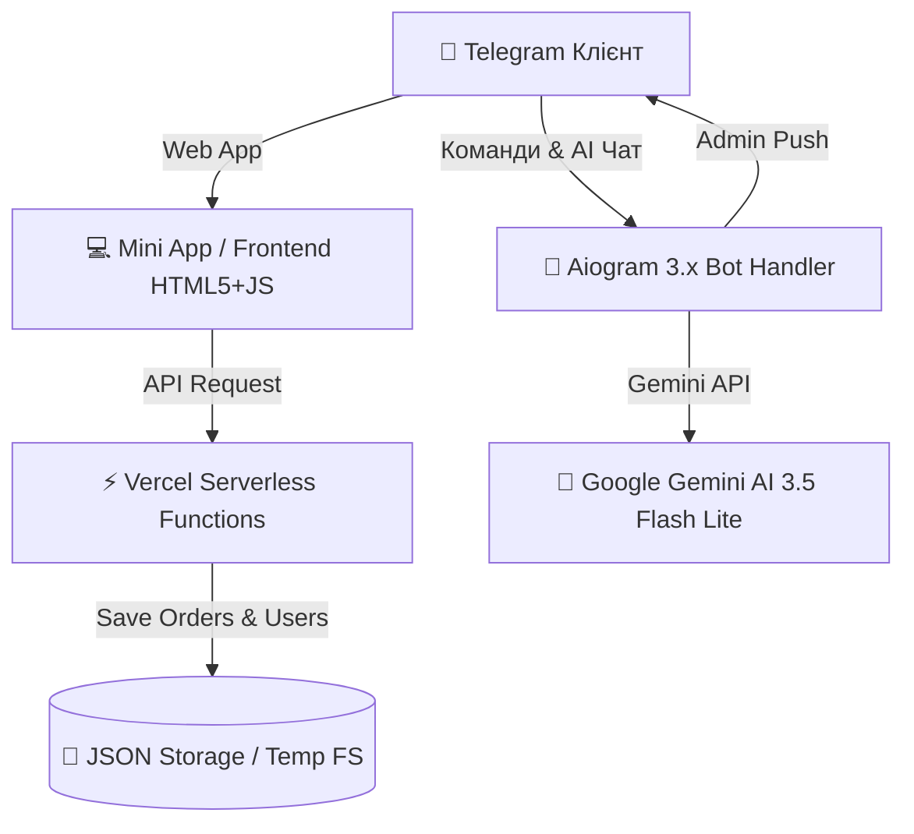

# 🧸 Store & Collectibles — E-Commerce Telegram Bot & Mini App 🛍️

[](https://www.python.org/)
[](https://docs.aiogram.dev/)
[](https://ai.google.dev/)
[](https://webapp-puce-ten-76.vercel.app)
[](https://opensource.org/licenses/MIT)

Повнофункціональна E-Commerce система для продажу колекційних фігурок, одягу та мерчу, яка поєднує **Telegram Mini App**, штучний інтелект **Google Gemini AI 3.5 Flash Lite**, розширену адмін-панель та автоматичний безсерверний деплой на **Vercel**.

---

## 🌟 Основні Можливості

### 🛍️ Telegram Mini App (Web App)
- **🎨 Преміальний UI/UX Design**: Сучасний темний стекльоморфізм, плавні мікро-анімації, адаптивна мобільна версія.
- **⚡ Flash Sales (Таймер Знижок)**: Динамічні лічильники акцій з анімованими бейджами знижок (`⚡ -15% 07:42:15`).
- **❤️ Wishlist (Обране / Закладки)**: Можливість зберігати улюблені товари з локальним збереженням та швидким фільтром.
- **📦 Нова Пошта Автодоповнення**: Інтерактивний вибір міст та відділень / поштоматів з випадаючим списком.
- **🎙️ Голосовий Пошук**: Пошук товарів голосом через Web Speech API з анімованим пульсуючим мікрофоном.
- **🌐 Мультимовність (🇺🇦 UA / 🇬🇧 EN)**: Миттєве перемикання мови інтерфейсу та автоматичний переклад назв і описів товарів.

### 🤖 AI-Консультант (Google Gemini AI 3.5 Flash Lite)
- **💬 Природний діалог**: AI допомагає обирати товари, описує стан (Mint, Sealed, Like New), перевіряє наявність та ціни.
- **⚙️ Автоматичні Адмін-Дії через Чат**:
  - Розсилка повідомлень: *«Зделай розсилку с таким текстом ЗДРАСТВУЙТЕ...»*
  - Додавання / видалення товарів та категорій простим текстом.
  - Активація промокодів та зміна статусів замовлень.
- **🛡️ Smart Fallback Engine**: Резервний офлайн-пошук товарів при досягненні квоти API.

### ⚙️ Адмін-Панель Telegram та Дашборд
- **📊 Дашборд Продажів**: Підрахунок виторгу, середнього чека, кількості унікальних клієнтів та ТОП-3 популярних товарів.
- **📢 Масова Push-Розсилка**: Розсилка новин та акцій з кнопками-посиланнями (`Текст | Назва Кнопки | URL`).
- **📄 Експорт Даних**: Завантаження звіту замовлень у форматах `.txt` та `.csv` за 1 клік.

---

## 🏗️ Архітектура та Технології



| Модуль | Технології |
|---|---|
| **Backend** | Python 3.12, Aiogram 3.17.0, Google GenAI SDK |
| **Frontend** | HTML5, Modern Vanilla CSS3, JavaScript ES6+, Web Speech API |
| **Serverless API** | Vercel Serverless Python Functions (`/api/*`) |
| **Storage** | Safe JSON Storage Engine (`storage.py`, `cart.py`, `bonuses.py`) |

---

## 📁 Структура Проекту

```text
d:/ai_bot/
├── main.py                  # Головна логіка Telegram бота (Aiogram 3)
├── admin.py                 # Адмін-панель, аналітика, розсилки, експорт
├── ai_manager.py            # Інтеграція Gemini AI 3.5 Flash Lite & Smart Fallback
├── storage.py               # Збереження замовлень, кошика, юзерів та історії
├── cart.py                  # Управління кошиком та каталогом товарів
├── bonuses.py               # Кешбек-бонусна система
├── categories.py            # Категорії товарів
├── reviews.py               # Відгуки та рейтинги товарів
├── web_server.py            # Web Server & REST API обробники
├── products.json            # Каталог товарів (з name_en, description_en)
├── promos.json              # Промокоди та знижки
├── deploy_to_vercel.bat     # Скрипт авто-деплою на Vercel у 1 клік
└── webapp/                  # Каталог Mini App для деплою на Vercel
    ├── index.html           # Головна сторінка Mini App
    ├── style.css            # Стилі, темний стекльоморфізм, анімації
    ├── app.js               # Логіка Mini App, Nova Poshta, Voice Search, i18n
    ├── vercel.json          # Конфігурація Vercel Serverless API
    └── api/                 # Serverless Endpoints
        ├── telegram.py      # Telegram Webhook endpoint
        ├── checkout.py      # Оформлення замовлень endpoint
        ├── products.py      # Отримання товарів endpoint
        ├── categories.py    # Отримання категорій endpoint
        ├── user_bonuses.py  # Кешбек бонуси endpoint
        └── validate_promo.py# Перевірка промокодів endpoint
```

---

## 🚀 Інструкція Локального Запуску

### 1. Клонування репозиторію
```bash
git clone https://github.com/kirilpuskaruk-svg/konsyltant1.git
cd konsyltant1
```

### 2. Створення та активація venv
```bash
python -m venv venv
# Windows:
venv\Scripts\activate
# Linux / macOS:
source venv/bin/activate
```

### 3. Встановлення залежностей
```bash
pip install -r requirements.txt
```

### 4. Налаштування `.env`
Створіть файл `.env` у корені проєкту:
```env
BOT_TOKEN=your_telegram_bot_token_here
GEMINI_API_KEY=your_gemini_api_key_here
WEB_APP_URL=https://webapp-puce-ten-76.vercel.app
ADMIN_ID=7150170715,8344881045
```

### 5. Запуск
```bash
python main.py
```

---

## ⚡ Автоматичний Деплой на Vercel

Для деплою оновлень на Vercel скористайтеся готовим скриптом:
- **Windows**: Запустіть файл `deploy_to_vercel.bat`

Або через CLI:
```bash
npx vercel --cwd webapp --yes --prod --force
```

---

## 📄 Ліцензія

Розповсюджується під ліцензією **MIT**.  
Розроблено з любов'ю для крафтового магазину **Store & Collectibles 🧸✨**.